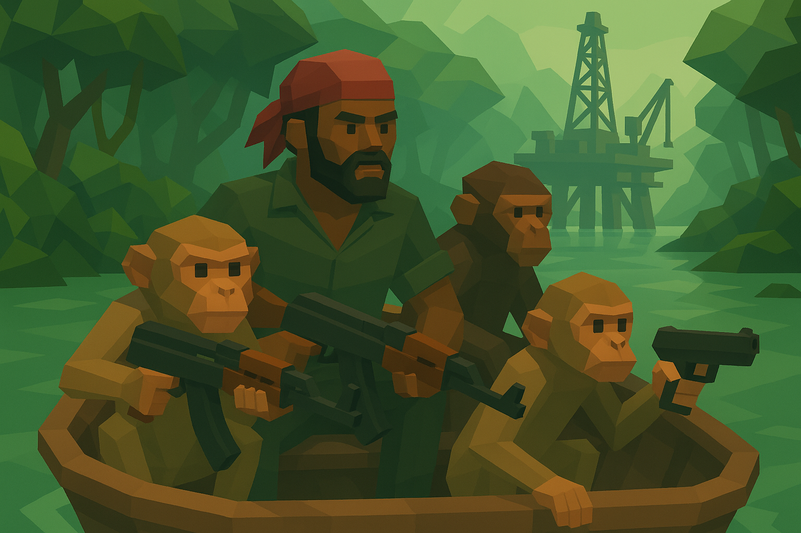
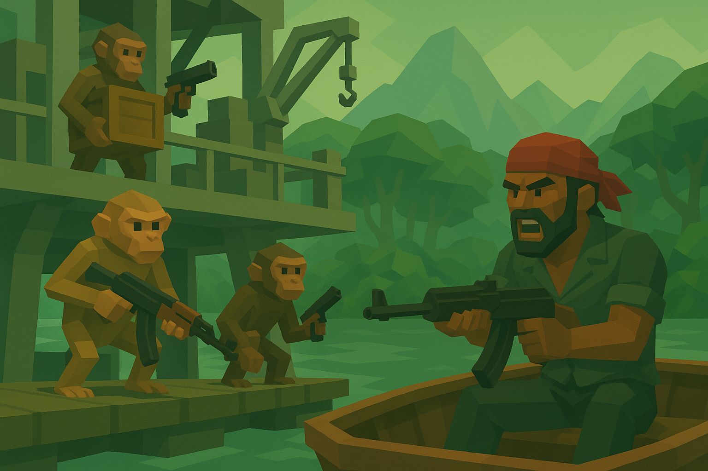
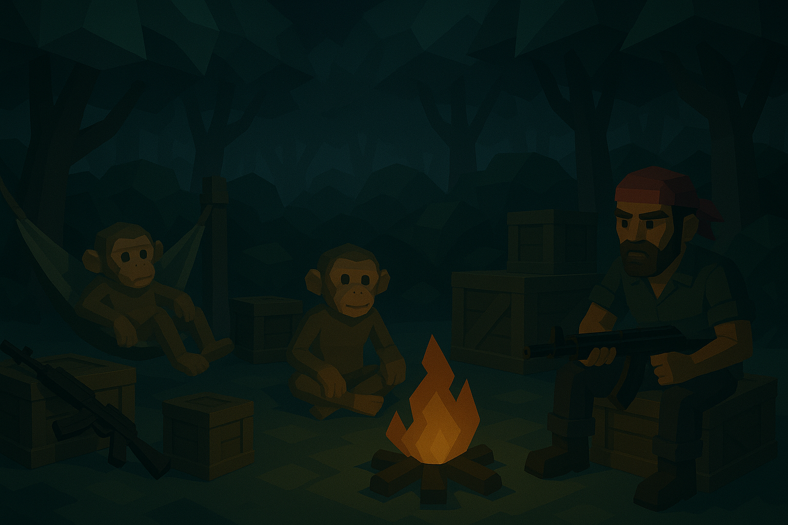

# 🌴 Jungle Marauders

**Jungle Marauders** is a solo indie concept for a unique pirate-survival game set in modern times.  
The player starts as a penniless outlaw deep in the jungle and works their way up from a tiny fishing boat to daring raids on cargo ships and offshore oil rigs.  

The heart of the game: **hireable monkeys** with different roles, abilities, and needs – from carriers and mercenaries to mechanics.  
They form the basis of an innovative gameplay loop unlike anything currently on the market.

---

## 🎮 Core Features

- **Rise from nothing** → start with a small boat, raid traders, and progress toward high-value targets  
- **Jungle base & black market** → secure resources, buy weapons, expand your hideout  
- **Monkey crew** → hire monkeys to carry loot, fight, repair, or sabotage  
- **Loyalty system** → keep your crew happy with bananas & coconuts – or risk corruption and betrayal  
- **Dynamic raids** → attack boats, freighters, and oil rigs defended by armed AI  
- **Tropical flair** → lush mangroves, hostile factions, and an atmospheric setting  

---

## 🐒 Monkey Classes

| Class        | Description                                                      | Strength                        | Weakness                      |
|--------------|------------------------------------------------------------------|----------------------------------|-------------------------------|
| **Carrier**  | Small, fast, carries light loot                                  | High speed                      | Cannot carry heavy objects    |
| **Tank**     | Big, strong, lifts heavy crates                                  | Can carry heavy loot            | Slow, less agile              |
| **Mercenary**| Can be armed, protects the crew                                  | Firepower & protection           | Requires ammunition           |
| **Mechanic** | Repairs boats & expands the camp                                 | Essential for progress           | Consumes many resources       |

---

## 🚀 Vision for the Future

- Expand with **new boats** (dinghies, fishing trawlers, freighters)  
- Add **enemy factions** and rival pirate groups  
- Introduce **dynamic events**: ambushes, smuggling missions, defense raids  
- Implement a **co-op mode** for raids with friends

  

---

## 📂 Project Status

🛠️ Currently: **Concept phase & first UE5 prototypes**  
📌 Goal: Build a working **core gameplay loop** (Boat → Raid → Hire monkeys → Secure loot)  

---

## 🌊 Why Jungle Marauders?

- No existing game combines **modern piracy**, **survival mechanics**, and **animal companions** in this way  
- **Highly scalable** for future updates and content  
- A blend of **gritty atmosphere** and **humorous twist** (monkeys with guns – need we say more?)

---

© 2025 HenrykProjects.  
This is a solo indie project. Ideas, mechanics, and artwork are subject to change.  
📫 Contact: Hendrik.Tijdink@outlook.de
